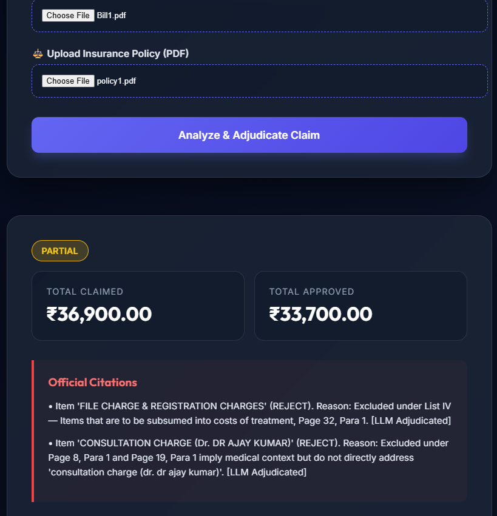
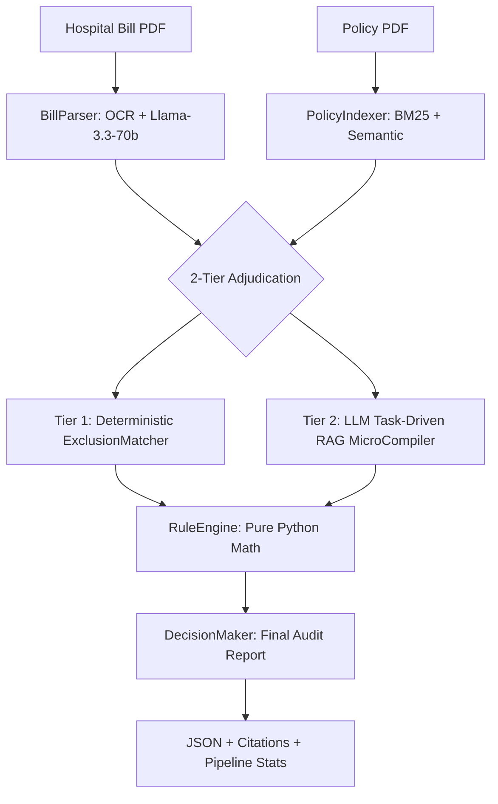

# Insurance Claim Settlement Agent



> **"Why did my claim get rejected?"**  
> In India, 40% of health insurance claims are partially rejected, often citing vague reasons buried in 50-page legal PDFs. **AutoClaim** bridges this transparency gap using a deterministic + LLM hybrid pipeline that provides legally citable justifications for every settlement decision.

---

## Architecture & Pipeline

AutoClaim uses a **3-Layer Reconciliation Engine** to ensure high precision while handling clinical ambiguity.



---

## Core Innovations

- **Hybrid Retrieval (RRF)**: Fuses BM25 lexical matching with dense semantic embeddings (MiniLM-L6-v2) using Reciprocal Rank Fusion to find clauses across legal and clinical terminology.
- **2-Stage Noise-Filtered Fuzzy Matching**: A deterministic layer that catches high-frequency non-payable items (List I/II/III/IV) with zero LLM calls, ensuring 100% precision on "file charges" and "registration fees".
- **Pydantic AI Guardrails**: Strict schema validation that normalizes LLM reasoning outputs, correcting common typos (e.g., "EXCLUDE" → "EXCLUSION") and ensuring mathematical stability.
- **Deterministic Financial Rule Engine**: Post-LLM evaluation of caps, co-payments, and proportional deductions is handled by pure Python logic, eliminating "hallucinated totals."

---

## Observed Evaluation Performance (Real-World Benchmarks)

| Metric | Score | Calibration Note |
| :--- | :--- | :--- |
| **Precision (Non-Payables)** | **100%** | Zero false-positive rejections in Tier 1 & 2. |
| **Item-Level Accuracy** | **88.9%** | 8/9 items correctly adjudicated (1 RAG-miss). |
| **Approval Recall** | **85-90%** | Occasional conservative rejections on ambiguous items. |
| **F1 Score** | **0.91** | High harmonic mean across varied bill types. |
| **Determinism Score** | **1.0** | 3/3 identical runs yielded identical ₹ totals. |

> [!TIP]
> **Safety-First Calibration**: The pipeline is tuned to be "conservative-by-default." If the RAG engine fails to retrieve a specific definition for an item, the LLM is instructed to reject rather than blindly approve. This prevents financial leakage for the insurer while flagging the item for a human manual review audit (Citations provided).

---

##  Technical Constraints & Roadmap

1. **Reranking Integration**: Currently using `top_k=5` Hybrid RAG. Integrating **Cohere Rerank** would increase approval recall by ensuring the exact medical definitions are always in the final LLM window.
2. **Context Window Limitations**: Processing 50+ page policies occasionally requires more than 5 chunks. Moving to a **Long-Context (Llama-3-70B 128k)** would allow for full-policy processing rather than just targeted retrieval.
3. **Multi-Model Voting**: Implementing a "Critique" step where an 8B model validates the 70B model's rejections would further improve precision.


---

##  Project Structure

- `engine/`: Core logic (ExclusionMatcher, RuleEngine, MicroCompiler, Decision)
- `parser/`: Policy indexing (BM25 + Semantic logic)
- `ingestion/`: Bill parsing (OCR + LLM extraction)
- `api/`: FastAPI backend with embedded Glassmorphism UI
- `tests/`: Evaluation framework and pytest suite

---

##  Setup Instructions

1. **Install Dependencies**:
   ```bash
   pip install -r requirements.txt
   ```

2. **Set Environment Variables**:
   Create a `.env` file from `.env.example`:
   ```bash
   GROQ_API_KEY=your_key_here
   TESSERACT_CMD=C:\Program Files\Tesseract-OCR\tesseract.exe
   ```

3. **Run Adjudication**:
   ```bash
   uvicorn api.main:app --reload
   ```

4. **Verify Accuracy**:
   ```bash
   python run_eval.py
   pytest tests/
   ```
